# Proyecto Restaurante

Sistema de Gestion de Restaurante

Sistema de gestion de restaurante desarrollado en C# que utiliza estructuras de datos implementadas desde cero (Listas Enlazadas, Colas y Pilas) sin usar las colecciones nativas de .NET.

Descripcion
Este proyecto es un sistema de consola que permite gestionar restaurantes, clientes, menus y pedidos. Implementa las siguientes estructuras de datos desde cero:

Lista Enlazada: Para gestionar restaurantes, clientes, platos y pedidos
Cola (FIFO): Para gestionar pedidos pendientes de despachar
Pila (LIFO): Para llevar el historial de platos servidos

Caracteristicas Principales

Gestion de Restaurantes
    Crear restaurantes con NIT unico
    Editar informacion del restaurante
    Listar todos los restaurantes registrados
    Validacion de campos obligatorios

Gestion de Clientes
    Crear clientes con cedula unica
    Editar informacion de clientes
    Borrar clientes (validando que no tengan pedidos pendientes)
    Listar todos los clientes
    Validacion de email y celular

Gestion de Platos (Menu)
    Crear platos con codigo unico
    Editar información de platos
    Borrar platos (validando que no esten en pedidos pendientes)
    Listar menu completo
    Validacion de precios

Gestion de Pedidos
    Tomar pedidos de clientes
    Agregar multiples platos con cantidades
    Encolar pedidos (FIFO)
    Despachar pedidos en orden de llegada
    Ver pedidos pendientes y todos los pedidos

Reportes
    Ganancias del dia
    Historial de platos servidos
    Lista completa de pedidos

Tecnologias utilizadas
Lenguaje: C# (.NET 9.0)
Tipo: Aplicación de Consola
IDE: Visual Studio Code

ESTRUCTURA DEL PROYECTO

Proyecto_Restaurante/
│
├── Estructuras/           // Estructuras de datos implementadas desde cero
│   ├── Nodo.cs
│   ├── ListaEnlazada.cs
│   ├── Cola.cs
│   └── Pila.cs
│
├── Modelos/            // Clases de dominio
│   ├── Restaurante.cs
│   ├── Cliente.cs
│   ├── Plato.cs
│   ├── PlatoPedido.cs
│   └── Pedido.cs
│
├── Servicios/            // Logica de negocio
│   ├── ServicioRestaurante.cs
│   ├── ServicioCliente.cs
│   ├── ServicioPlato.cs
│   └── ServicioPedido.cs
│
├── UI/                   // Interfaz de usuario (menus)
│   ├── MenuPrincipal.cs
│   ├── MenuRestaurante.cs
│   ├── MenuCliente.cs
│   ├── MenuPlato.cs
│   ├── MenuPedido.cs
│   └── MenuReportes.cs
│
├── Utilidades/           // Clases auxiliares
│   └── Validaciones.cs
|
├── .gitignore
├── Program.cs            // Punto de entrada
├── Proyecto_Restaurante.csproj
├── Proyecto_Restaurante.sln
└── README.md

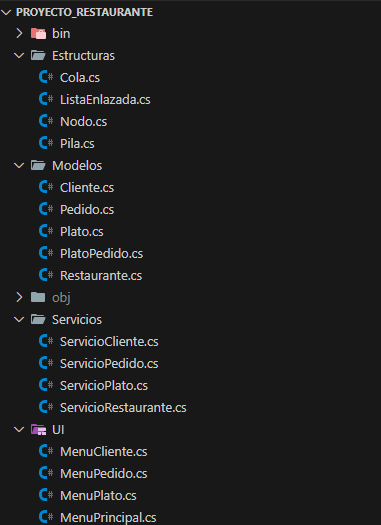

Manual de Uso
1. Menu Principal
Al iniciar el sistema, veras el menu principal con las siguientes opciones:
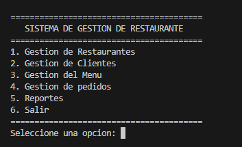

2. Gestion de Restaurantes
Crear Restaurante

    Seleccionar opcion "1. Gestion de Restaurantes"
    Seleccionar "1. Crear Restaurante"
    Ingresar los datos solicitados:
        NIT (unico, no puede repetirse)
        Nombre del restaurante
        Nombre del dueño
        Celular (10 digitos)
        Dirección
    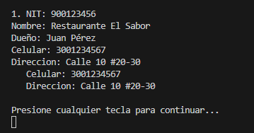

3. Gestion de Clientes
Crear Cliente

    Seleccionar "2. Gestion de Clientes"
    Seleccionar "1. Crear Cliente"
    Ingresar:
        Cedula (unica)
        Nombre completo
        Celular (10 dígitos)
        Email (formato valido)
    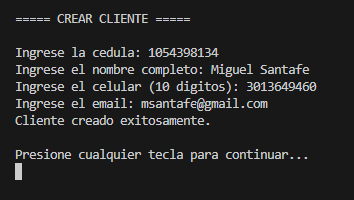
    
    Listar Clientes
        Muestra todos los clientes con su informacion
        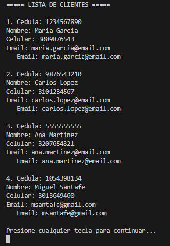
    
    Borrar Cliente
        Importante: Solo se pueden borrar clientes que NO tengan pedidos pendientes
        El sistema valida automaticamente antes de eliminar

4. Gestion de Platos (Menu)
Crear Plato
    Seleccionar "3. Gestion de Platos (Menu)"
    Seleccionar "1. Crear Plato"
    Ingresar:
        Código (unico, ej: P001)
        Nombre del plato
        Descripcion
        Precio (mayor a 0)
    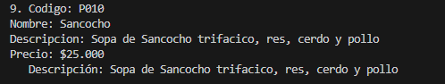

    Listar Platos
        Muestra el menu completo con todos los platos disponibles
        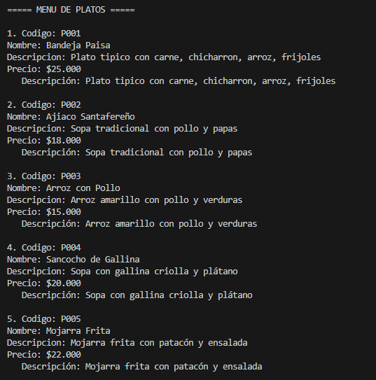
    
    Borrar Plato
        Importante: Solo se pueden borrar platos que NO esten en pedidos pendientes

5. Gestion de Pedidos
Tomar Pedido
    Este es el proceso completo para crear un pedido:

    Seleccionar "4. Gestion de Pedidos"
    Seleccionar "1. Tomar Pedido"
    Seleccionar el cliente por cedula
    Ver el menu de platos disponibles
    Agregar platos al pedido:
        Ingresar codigo del plato
        Ingresar cantidad
        Repetir para agregar mas platos

    Ver resumen del pedido con el total
    Confirmar el pedido
    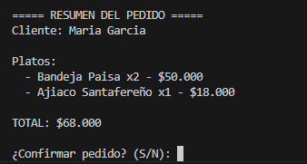

    Despachar Pedido
        Seleccionar "2. Despachar Pedido"
        El sistema despachara el PRIMER pedido de la cola (FIFO)
        El pedido cambia a estado "DESPACHADO"
        Se suma al total de ganancias del día
        Los platos se agregan al historial
        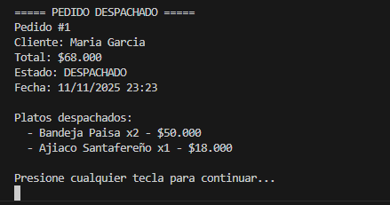

    Ver Pedidos Pendientes
        Muestra la cola de pedidos que estan esperando ser despachados
        

    Ver Todos los Pedidos
        Lista todos los pedidos (pendientes y despachados) con su informacion completa
        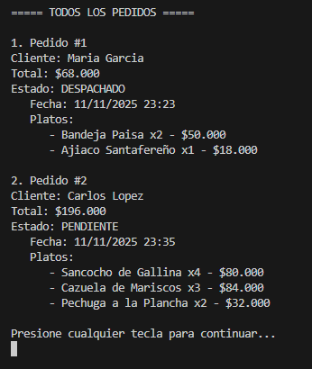

6. Reportes
Ganancias del Dia
    Muestra el total de dinero ganado en el dia actual (suma de todos los pedidos despachados)
    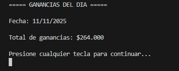

    Historial de Platos Servidos
        Muestra una pila con los ultimos platos servidos (LIFO - Last In, First Out)
        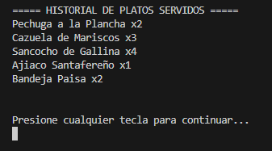
    

Validaciones y Reglas de Negocio
Validaciones Implementadas

1. Restaurante
    NIT unico (no puede repetirse)
    Todos los campos son obligatorios
    Celular debe tener 10 digitos

2. Cliente
    Cedula unica
    Email con formato valido (@dominio.com)
    Celular de 10 digitos
    No se puede borrar si tiene pedidos PENDIENTES

3. Plato
    Codigo unico
    Precio mayor a 0
    No se puede borrar si esta en pedidos PENDIENTES

4. Pedido
    Debe tener al menos un plato
    Las cantidades deben ser mayores a 0
    El cliente debe existir
    Los platos deben existir en el menu

Reglas de Negocio
    1. Cola de Pedidos (FIFO)
        Los pedidos se despachan en orden de llegada
        No se puede despachar si la cola esta vacia

    2. Ganancias
        Solo se contabilizan pedidos DESPACHADOS
        Se calcula por día

    3. Historial (Pila)
        Los platos se agregan al historial al despachar
        Se muestran del mas reciente al mas antiguo

    4. Integridad de Datos
        No se pueden borrar clientes con pedidos pendientes
        No se pueden borrar platos que esten en pedidos pendientes

Datos de Ejemplo
    El sistema incluye datos de prueba que se cargan automaticamente:

    Restaurante
        Restaurante El Sabor (NIT: 900123456)

    Clientes
        Maria Garcia (CC: 1234567890)
        Carlos Lopez (CC: 9876543210)
        Ana Martinez (CC: 5555555555)

    Platos
        P001: Bandeja Paisa - $25,000
        P002: Ajiaco Santafereño - $18,000
        P003: Arroz con Pollo - $15,000
        P004: Sancocho de Gallina - $20,000
        P005: Mojarra Frita - $22,000
        P006: Cazuela de Mariscos - $28,000
        P007: Lomo de Cerdo - $24,000
        P008: Pechuga a la Plancha - $16,000